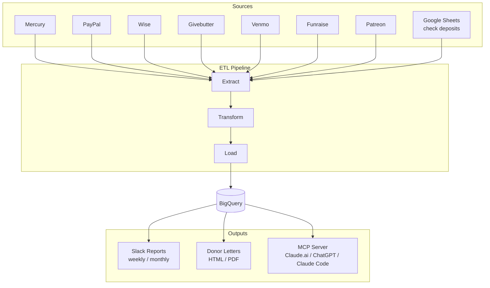

# Nonprofit Toolkit

A toolkit that AI coding assistants use to set up and manage donation data infrastructure for US nonprofits. You talk to your assistant; it uses the skills and code in this repo to do the work.

## What it does

US nonprofits receive donations through many channels -- banks, PayPal, fundraising platforms, checks, peer-to-peer apps, international transfers. This toolkit pulls all of that into one place so you can query it, report on it, and generate donor letters.

You don't run scripts or edit config files. You fork this repo, open an AI assistant (Claude Code, Codex, Gemini, etc.), and tell it what you need. The toolkit provides skills that handle setup, deployment, connectors, querying, and more.



## What you can do

- **Set up from scratch** -- fork, clone, tell your assistant to run `/setup` or `/bootstrap`
- **Add data sources** -- connectors exist for Mercury, PayPal, Wise, Givebutter, Venmo, Funraise, Patreon, and Google Sheets (checks). Add more with `/create-connector`
- **Query donations** -- ask natural language questions about your data via the MCP server, Slack bot, or `/donations-query`
- **Generate donor letters** -- produce tax-receipt-ready confirmation letters on demand
- **Get reports in Slack** -- automated weekly and monthly donation summaries
- **Deploy** -- provision GCP infrastructure and deploy to Cloud Run with `/provision` and `/deploying-etl`
- **Extend** -- the assistant can build new features, connectors, and integrations on top of the unified data

## Getting started

**Setup requires a software engineer** -- you'll need someone comfortable with concepts like deployment, databases, API keys, and MCP. No code needs to be written, but the initial setup involves infrastructure decisions and credential management.

**Day-to-day use does not** -- once deployed, anyone can query donations, generate letters, and get reports by talking to Claude.ai, ChatGPT, or a Slack bot.

### Setup

Fork this repo, clone your fork, and open an AI assistant in the project directory.

```
cd nonprofit-toolkit
claude   # or codex, gemini, etc.
```

Ask it to set things up. It will walk you through credentials, infrastructure, and deployment. If you want BigQuery and GCP (the defaults), it handles everything. If you want something different, tell it -- the code is yours to change.

### Usage

Once deployed, connect the MCP server to Claude.ai or ChatGPT to ask questions like _"how much did we raise last month"_ or _"generate a thank you letter to John Smith for his 2025 donations"_.

## Architecture

```
nonprofit-toolkit/
  packages/
    types/          # Shared TypeScript types and Zod schemas
    connectors/     # Data source connectors
    bq/             # BigQuery loading and query utilities
    letter/         # Donor confirmation letter generation
  apps/
    runner/         # ETL pipeline runner (Cloud Run job)
    service/        # Slack bot and MCP server
```

Built with Bun, TypeScript (strict mode), Zod, neverthrow, and Vitest. Deploys to GCP Cloud Run. Uses BigQuery as the data warehouse and Slack for notifications.

**Built with AI** -- this codebase was primarily written by [Claude Code](https://claude.com/claude-code) and [Codex](https://openai.com/index/codex/).

## License

MIT. See [LICENSE](LICENSE).
